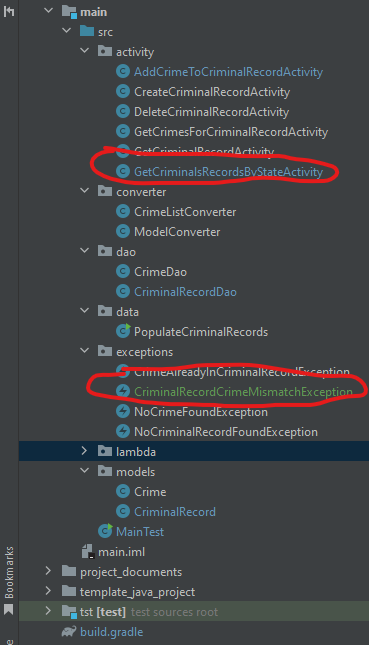
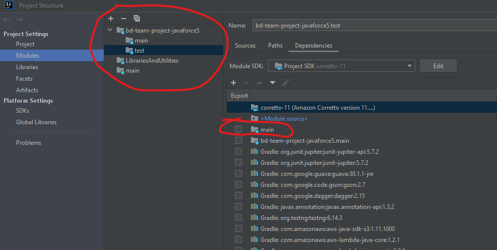
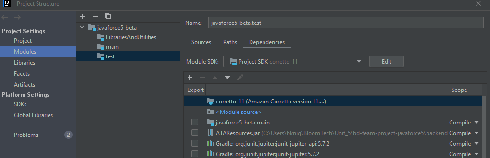
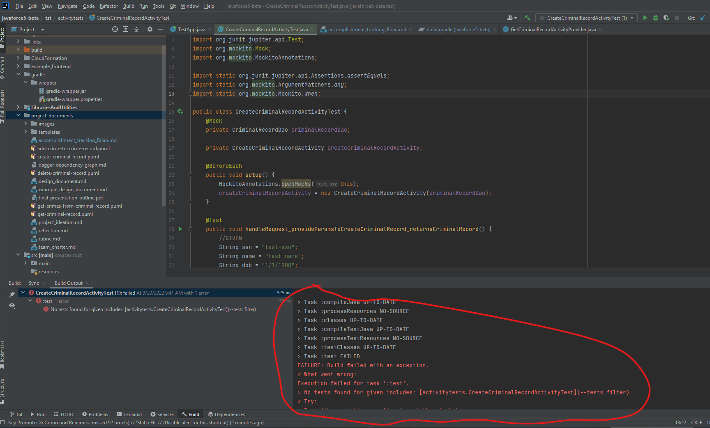
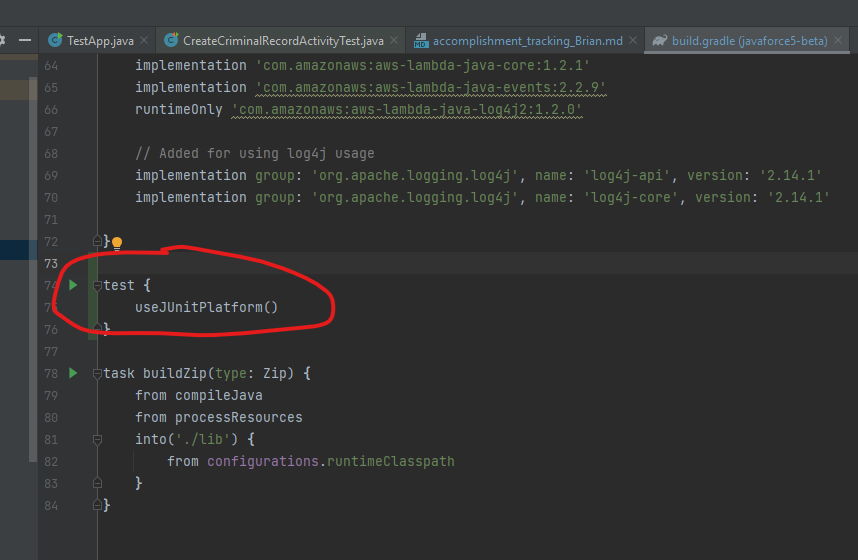
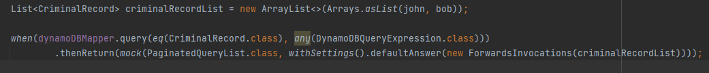
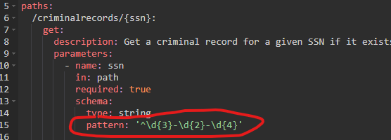
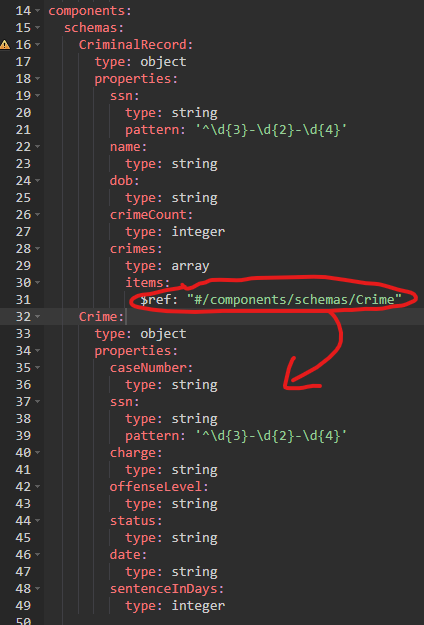
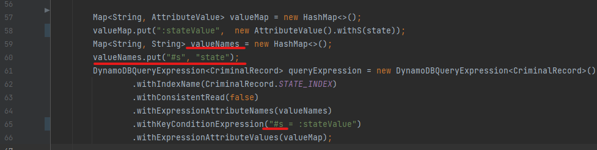
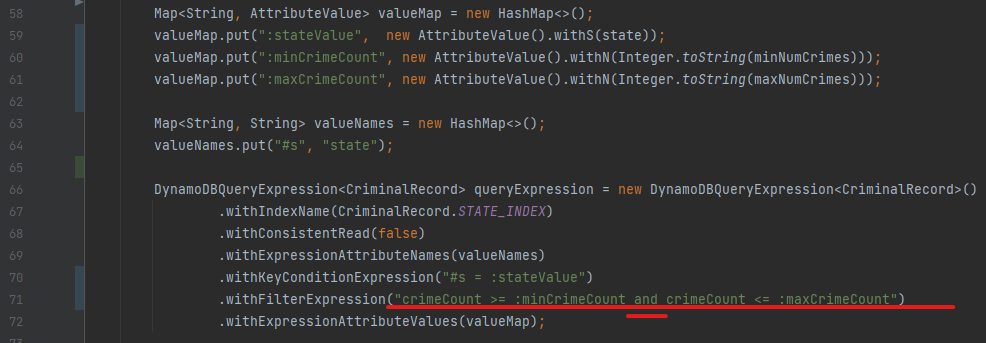

# Brian Knight- JavaForce5 Accomplishment Tracking

Each team member should have their own version of this document.

## Background

It's a great habit to record accomplishments and progress throughout your SDE
career. It's useful to reflect on what you've worked on in the past and comes in
handy during performance reviews and promotion cycles.

## Instructions

**Save a copy of this document in your “private” folder.**

Using the below template, keep track of what you’ve worked on each week during
the unit. 1-3 bullets under each section for each week should suffice. This
should only take 5 - 10 minutes of reflection each week.

As you track your work, think about how it relates to the SDE fundamental skills
laid out in the syllabus and how you are practicing them.

* Converts a design into code and delivers it using best practices
* Writes secure, testable, maintainable code
* Understands when to use (or not) a broad range of data structures and
  algorithms
* Creates unit tests that thoroughly test functionality
* Troubleshoots by debugging and reviewing errors, logfiles, and metrics
* Contributes to planning and design
* Escalates when projects hit roadblocks and risks

The important work samples don’t only include the things you authored, but
should include things like key CRs you reviewed that you are proud of as well!

_You will submit your completed Accomplishment Tracking Document to your
instructors by the end of the unit._

## Week 1

**Goals:**
* Stay on track with modules.

**Activity:**
* Cloned repo
* Create team name
* Project Ideation completed choosing a project for a Criminal Records Database
* Wrote a problem statement
* Completed mock Team Charter
* Completed draft of design document

**Important Docs, Commits, or Code Reviews**:
* Completed work was pushed to GitHub under Sprint_1 branch.

**Things learned:**
* I used PUML plugin to create images for my endpoints.
* I learned the thought process of first creating use cases in order to determine requirements and endpoints.

## Week 2

**Goals:**
* Get fingers to keyboard and begin coding. 
* Setup my POJO classes and tables in DynamoDB.

**Activity:**
* Created Trello account and project board
* Started building the project

**Important Docs, Commits, or Code Reviews**:
* Updates are pushing to Sprint_1 branch in GitHub.

**Things learned:**
  * I created and populated my Crimes DDB table using a JSON file and AWS CLI commands.
  * I figured out how to save the ATAResources.jar file and add it to dependencies in order to import DynamoDB classes. 
    * Project Structure > Modules > Dependencies > add file
  * My initial attempt to run a test to map an item to DDB table failed: 
  "the output path is not specified for module...". 
  I created a "build" directory and updated the settings: 
    * Project Structure > Project > Compiler output: > ~\BloomTech\Unit_5\bd-team-project-javaforce5\build 
  * In previous projects for DDB table we stored a List<Type> as a string in JSON format. 
   In order for DDB mapper to load a table item with a List in this format, a DynamoDBTypeConverter is needed. 
    * "@DynamoDBTypeConverted(converter = CrimeListConverter.class)" annotation was added to the attribute in CriminalRecord class.
  * In order to delete an item using DynamoDB mapper.delete() you need to pass in the object not just the key.
  * When classes and files are shown in different colors in IntelliJ's Project directory tree, it represents a status. 
    * https://www.jetbrains.com/help/idea/file-status-highlights.html#views  
      
  * After reading Module 5 activity Intro to Global Secondary Indexes, 
    I would have taken a different approach to designing my DDB tables.
    It would make more sense to have the Crime table as a composite primary key SSN : Case Number.
    I could then lookup all crimes for an individual and also allow for more options
    querying for statistical purposes on other attributes.
  * AWS CloudFormation would not let me update a table with multiple GSIs at the same time.
    I had to do them one at a time using CLI commands to "aws cloudformation update-stack"
  * 
  

## Week 3

**Goals:**
* Write unit tests
* create AWS Lambda Functions
* Create endpoints
* Create webpages

**Activity:**

**Important Docs, Commits, or Code Reviews**:

**Things learned:**
* GRADLE
  * Setting up the initial project with a proper structure and Gradle build is crucial.
    * Somehow I initially setup the project with multiple main modules which was causing issues with dependencies, importing classes, and unit tests.
    * The order in which the dependencies are listed is same order in which IntelliJ will process them. I attempted to change this order which fixed some issues but cause other problems.   
       
       
      
      After restructuring the project:   
      
       
       
  * build.gradle file needs to have the proper dependencies, tasks, sources, etc
    * I had to add some dependencies that were missing.
    * My Unit Tests were failing to build. I read Gradle documentation (https://docs.gradle.org/current/userguide/userguide.html) and tried a tutorial. I figured out the build.gradle file was missing a component for tests to run properly.
        
      
        
    Adding these lines fixed the problem:
      
        
* Mockito has a mocking tool to convert a PaginatedQueryList\<T> returned by DynamoDBMapper query into a List\<T>:
      
* RequestHandler<I,O> interface and Request POJOs
  * In Unit 4's project I did not understand why Request & Result POJOs were being used. 
  I initially created my activity classes to accept String and Integer parameters instead of Request objects.
  When trying to test my AWS Lambda functions with a JSON event, I ran into issues. If there was a single string parameter, I could get it to work but not otherwise. 
  Implementing the RequestHandler interface and Request objects, is more versatile for executing the Lambda functions. 
  *This caused a significant amount of reworking my code needing to implement the interface and updating methods, contructors, and unit tests.* 
* Swagger/API Gateway
  * You can use "pattern:" to require a specific formatting for a string.
    * For example with a SSN format ddd-dd-dddd:
     
    
      
  * Defining a List type can be done with an array in Swagger broken down into further types string, integer, etc.
    You can also create the List/array as its own component and use the reference:
     
    
      
* DynamoDBQueryExpression
  * DDB has reserved keywords. My attribute for state is a reserved keyword in DDB. By using ExpressionAttributeName you can assign placeholders as an alternative:  
   
      
   
   
  * There is an attribute for FilterExpression which is used to filter the DDB table query. 
    * You can set multiple filters by using a keyword like "and".
    * The filter is done AFTER the query returns items matching the KeyConditionExpression. 
      It does not result in additional read capacity units. 
      Depending on use cases and frequency it might be better to create a more appropriate GSI to reduce the initial read capacity.
      
      
        
  * 

## Week 4

**Goals:**

**Activity:**

**Important Docs, Commits, or Code Reviews**:

**Things learned:**
