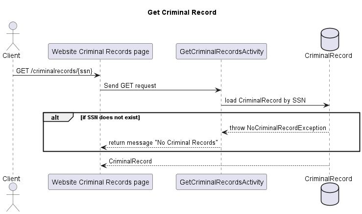
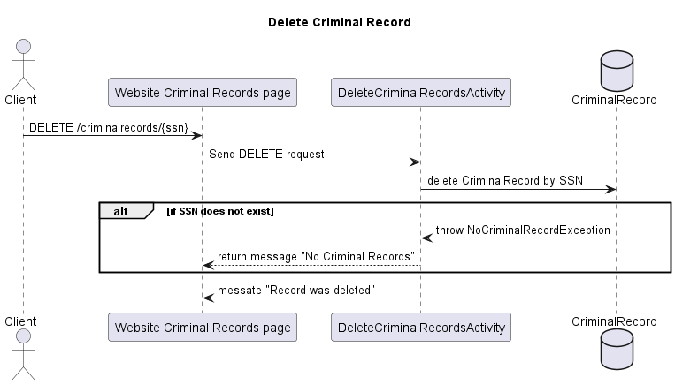
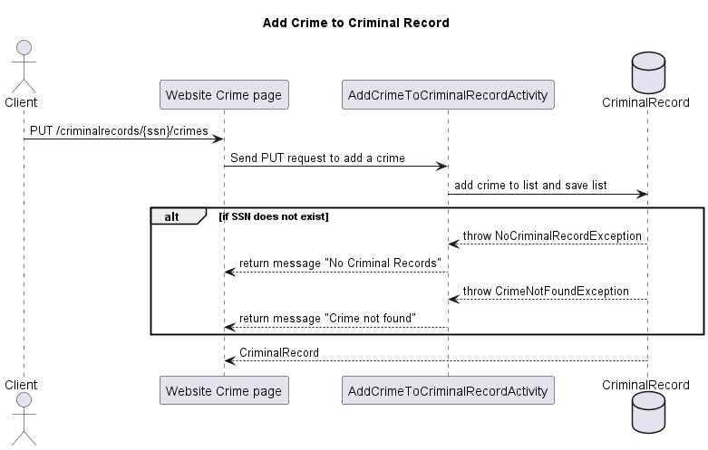
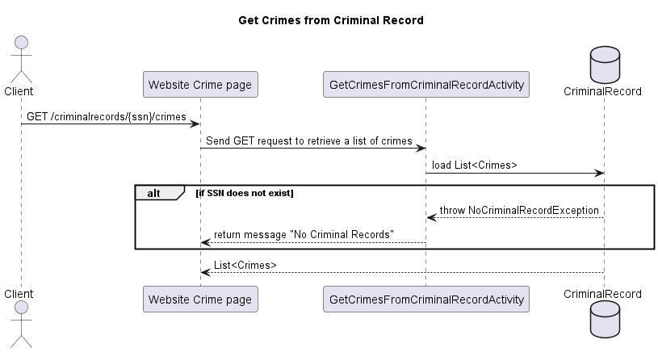
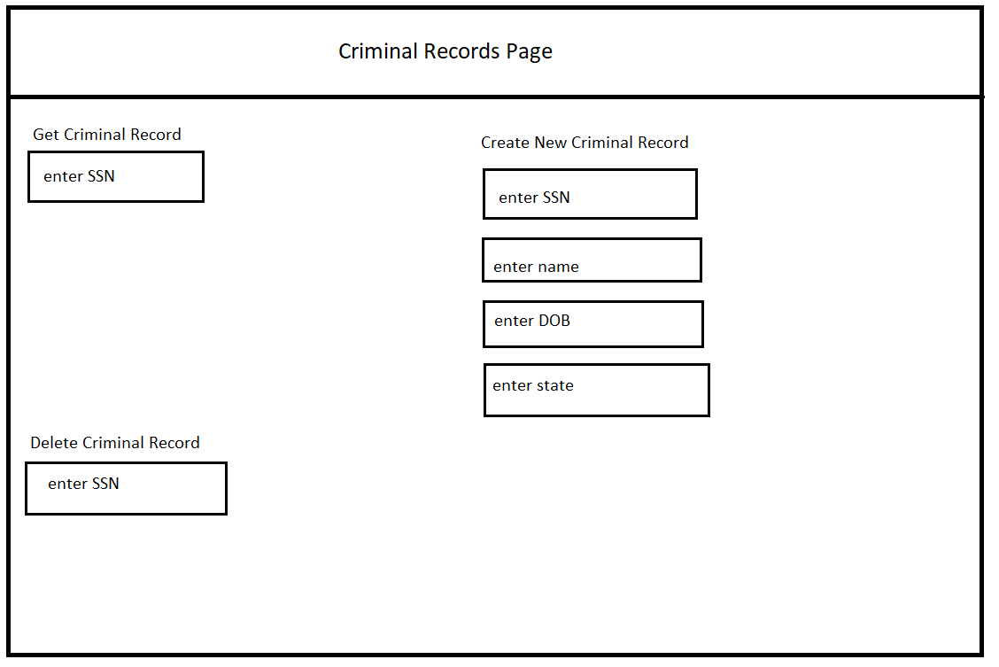
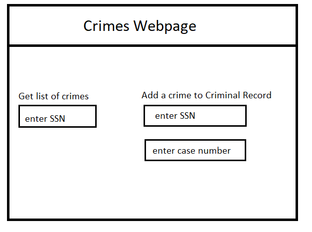

# JavaForce5 Design Document

## Criminal Records Database Design

## 1. Problem Statement
Many crimes are committed every day which each have a lot of associated information. It is important to keep a detailed database of these criminal records. They are used by a number of entities such as police, states, employers, landlords, stalkers, etc.  

This design document describes a basic criminal records service that allows an agency such as a police department to read, add, update, and delete criminal records.
## 2. Top Questions to Resolve in Review

*List the most important questions you have about your design, or things that
you are still debating internally that you might like help working through.*

1. Should I create separate tables for Crimes, CriminalRecord, and Criminal/Person? I could possibly have a crime with multiple criminals and criminals with multiple crimes.
   1. Maybe have a CriminalRecord for a person with their personal data and a list of Crimes committed.
2. Depending on the structure what is a single partition primary key or composite primary key appropriate?
3. Is there a need to identify all CriminalRecords by location, date, Criminal, type, status, etc?
   1. This could be an opportunity for creating DDB indexes.


## 3. Use Cases

*This is where we work backwards from the customer and define what our customers
would like to do (and why). You may also include use cases for yourselves, or
for the organization providing the product to customers.*

U1. As a customer, I want to create a new criminal record for a first time offender.

U2. As a customer, I want to retrieve a CriminalRecord to see if it exists for a person.

U3. As a customer, if a CriminalRecord exists, I want to retrieve a list of their crimes. 

U4. As a customer, I want to add a new crime to person's list of crimes.

U5. As a customer, I want to update a crime in a person's list if a case status changes (pending, convicted, acquitted, etc.).

U6. As a customer, I want to delete a criminal record if ordered to be expunged by the court.

U7. As a customer, I want to retrieve crimes by status.

U8. As a customer, I want to retrieve crimes by date.

U9. As a customer, I want to retrieve crimes by offense level.

U10. As a customer, I want to retrieve crimes by location.

U11. As a customer, I want to retrieve all CriminalRecords by state for statistical purposes.


## 4. Project Scope

### 4.1. In Scope
* CRUD operations for a single criminal record.
   * Create a new record
   * Retrieve existing record
   * Update a record by adding a crime to the list
   * Delete a record
* Use at least one secondary index on the DDB table to run a query.
  * U11 retrieve records by status.


### 4.2. Out of Scope
* U5 updating a Crime within the list of Crimes in a CriminalRecord.
* There would be multiple needs to look up crime statistics by secondary indexes (use cases U7-U10). 
   For purposes of this project U7-U10 will be out of scope.
* CRUD operations for Crimes table. Will populate with a set of fixed set of Crimes.

# 5. Proposed Architecture Overview

This initial iteration will provide the minimum lovable product (MLP) including
creating, retrieving, updating, and deleting a criminal record.

We will use API Gateway and Lambda to create four endpoints (`CreateCriminalRecord`, `GetCriminalRecord`,
 `UpdateCriminalRecord`, and `DeleteCriminalRecord`)
that will handle the creation, updating, retrieval, and deleting criminal records to satisfy the requirements.

Criminal records will be stored in DynamoDB table using a composite primary key of 
Social Security Number for the partition key and case number for sort key.

We will provide a web interface for users to manage the criminal record database.

# 6. API

## 6.1. Public Models

```
// CriminalRecord

String ssn;
String name;
String dob;
String state;
Integer crimeCount;
List<Crime> crimes;
```
```
// Crime

String caseNumber;
String ssn;
String charge;
String offenseLevel;
String status;
String date;
Integer sentence;

```

## 6.2. Get CriminalRecord Endpoint

* Accepts GET requests to /criminalrecords/{ssn}
* Accepts a Social Security Number (SSN) and returns the record for that person.
  * If the SSN is not found, throw a NoCriminalRecordException



## 6.3 Create CriminalRecord Endpoint

* Accepts POST requests to /criminalrecords
* Accepts data to create a new CriminalRecord with SSN, name, DOB, zipcode, and state.
* For security concerns, we will validate the provided playlist name does not contain any invalid characters: " ' \`
  If the playlist name contains any of the invalid characters, will throw an InvalidAttributeValueException.


## 6.4 Delete CriminalRecord Endpoint

* Accepts DELETE requests to /criminalrecords/{ssn}
* Accepts a Social Security Number (SSN) and deletes the record for that person.
    * If the SSN is not found, throw a NoCriminalRecordException
  


## 6.5 Add Crime to CriminalRecord Endpoint

* Accepts PUT requests to /criminalrecords/{ssn}/crimes
* Accepts a SSN and a Crime to be added to that person's list of Crimes
  * If the SSN is not found, throw a NoCriminalRecordException
  * If the Crime is not found, throw CrimeNotFoundException



## 6.6 Get CriminalRecord crimes Endpoint

* Accepts GET requests to /criminalrecords/{ssn}/crimes
* Retrieves list of all crimes committed by the person with given SSN
  * If the SSN is not found, throw a NoCriminalRecordException



# 7. Tables

## 7.1 criminal_records
```
ssn // partition key, string
name // string
dob // string
state // string
crimeCount // integer
crimes // List of Crimes
```

## 7.2 crimes
```
caseNumber // partition key, string
charge // string
offenseLevel // string
status // string
date // string
sentence // integer
```

# 8. Pages



